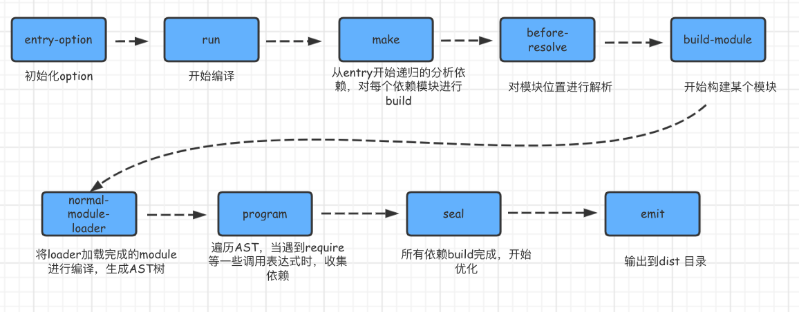

# webpack 构建流程

> V4.x 版本

❓ webpack 构建流程分析

## 优解 🚀

webpack 的运行流程是一个串行的过程，从启动到结束会依次执行以下流程：

- 首先会从配置文件和 Shell 语句中读取与合并参数，并初始化需要使用的插件和配置插件等执行环境所需要的参数；
- 初始化完成后会调用Compiler的run来真正启动webpack编译构建过程
- webpack的构建流程包括compile、make、build、seal、emit阶段，执行完这些阶段就完成了构建过程。

