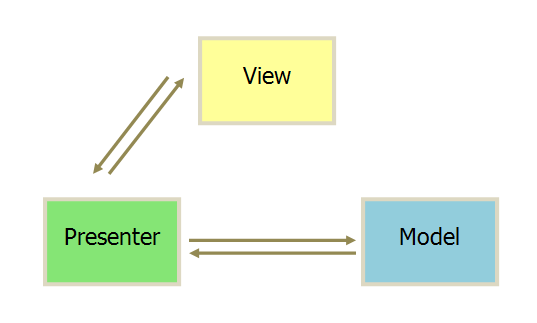

# P1

> MVC、MVP、MVVM架构模式

❓介绍下 MVC、MVP、MVVM架构模式

## 优解 🚀

> [MVC，MVP 和 MVVM 的图示](http://www.ruanyifeng.com/blog/2015/02/mvcmvp_mvvm.html)

- 视图（View）：用户界面。
- 控制器（Controller）：业务逻辑
- 模型（Model）：数据保存

- 各部分之间的通信，都是双向的。
- View 与 Model 不发生联系，都通过 Presenter 传递。
- View 非常薄，不部署任何业务逻辑，称为"被动视图"（Passive View），即没有任何主动性，而 Presenter非常厚，所有逻辑都部署在那里。

MVVM 模式将 Presenter 改名为 ViewModel，基本上与 MVP 模式完全一致。
唯一的区别是，它采用双向绑定（data-binding）：View的变动，自动反映在 ViewModel

## 数据响应

> 数据变更检测，改变view层

**手动触发绑定**:

主要思路是通过在数据对象上定义get()方法和set()方法，调用的时候手动触发get()、set()函数来获取、修改数据，而改变数据后也会主动触发get()、set()函数进行View层的重新渲染。

**脏检测机制**:

基本原理是在ViewModel对象的某个属性值发生变化时找到与这个属性值相关的所有元素，然后比较数据是否发生变化，如果变化则调用Directive指定，对这个元素重新扫描渲染。
例如 angular

**数据劫持**:

数据劫持是使用比较广的方式。比如Vue。大概思路就是使用Object.defineProperty和Object.defineProperies对ViewModel数据对象进行属性get()、set()的监听。当有新的数据读取恶化赋值操作的时候则进行扫描元素节点，运行对应的节点的Directive(指令)，这样ViewModel使用通用的等号赋值就可以了。相信对Object.defineProperty有所了解的同学会很容易理解。

**Proxy**:

ES6为我们提供了一个Proxy特性，它可以在已有的对象基础上重新定义一个对象，并重新定义对象原型上的方法，包括get()和set()方法。

## 总结

前端框架从DOM操作到MVC、MVP以及现在的MVVM设计，都是为了解决前端开发的效率、维护、扩展等问题，总的方向是越来月方便我们开发者。当然，这仅仅是 提高了开发效率，本质上还是对DOM的操作。了解DOM操作开销的同学，都知道操作DOM是极其消耗资源的，所以前端开发领域又提出Virtual DOM，即虚拟DOM。所以这也是我们需要掌握的。
