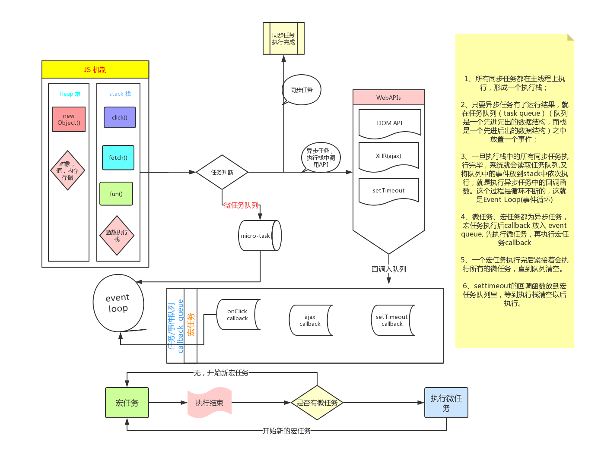

# P13

> JS 任务执行顺序

**⚡题目**:

❓ 判断下面代码执行结果

```js
async function async1() {
  console.log(1);
  const result = await async2();
  console.log(3);
}

async function async2() {
  console.log(2);
}

Promise.resolve().then(() => {
  console.log(4);
});

setTimeout(() => {
  console.log(5);
});

async1();
console.log(6);

```

## 优解 🔥

`[1, 2, 6, 4, 3, 5]`

这道题目主要考对JS宏任务和微任务的理解程度，JS的事件循环中每个宏任务称为一个Tick(标记)，在每个标记的末尾会追加一个微任务队列，一个宏任务执行完后紧接着会执行所有的微任务，直到队列清空。
settimeout的回调函数放到宏任务队列里，等到执行栈清空以后执行。

复杂点的在于async1函数，async1函数本身会返回一个Promise，同时await后面紧跟着async2函数返回的Promise，`console.log(3)`其实是在async2函数返回的Promise的then语句中执行的，then语句本身也会返回一个Promise然后追加到微任务队列中，所以在微任务队列中`console.log(3)`在`console.log(4)`后面


