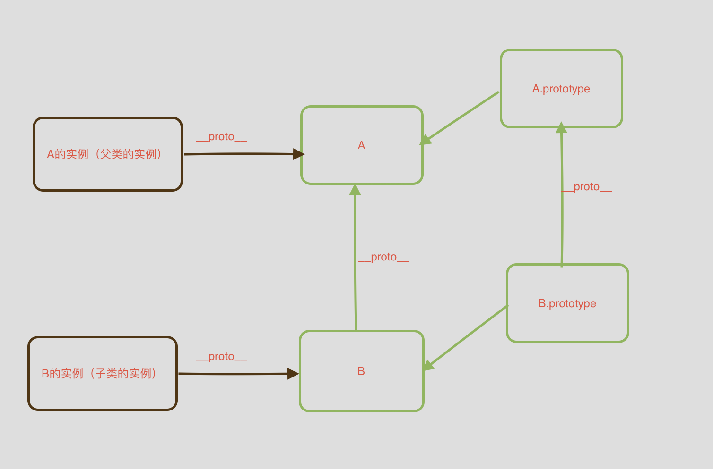

# P19

> JS 面试

**⚡题目**:

❓ ES5/ES6继承差异

## 优解 🔥

ES6

```js
class Super {}
class Sub extends Super {}

const sub = new Sub();

Sub.__proto__ === Super;
```

babel解析

```js
function Super(){}
let Sub = Object.create(Super)

Sub.__proto__ === Super; //true
```

子类可以直接通过 __proto__ 寻址到父类。

ES5

```js
function Super() {}
function Sub() {}

Sub.prototype = new Super();
Sub.prototype.constructor = Sub;

var sub = new Sub();

Sub.__proto__ === Function.prototype;

/*
 sub.__proto__ => Sub.prototype
 Sub.prototype.__proto__ => Super.prototype
 Super.prototype.constructor => Super
*/
```
而通过 ES5 的方式，Sub.__proto__ === Function.prototype

ES5 和 ES6 子类 this 生成顺序不同。ES5 的继承先生成了子类实例，再调用父类的构造函数修饰子类实例，ES6 的继承先生成父类实例，再调用子类的构造函数修饰父类实例。这个差别使得 ES6 可以继承内置对象。

```js
function MyES5Array() {
  Array.call(this, arguments);
}

// it's useless
const arrayES5 = new MyES5Array(3); // arrayES5: MyES5Array {}

class MyES6Array extends Array {}

// it's ok
const arrayES6 = new MyES6Array(3); // arrayES6: MyES6Array(3) []
```

## 总结



- ES5的继承，ES6的继承实现在于使用**super关键字**调用父类，反观ES5是通过**call或者apply回调方法或使用原型链继承**调用父类。
