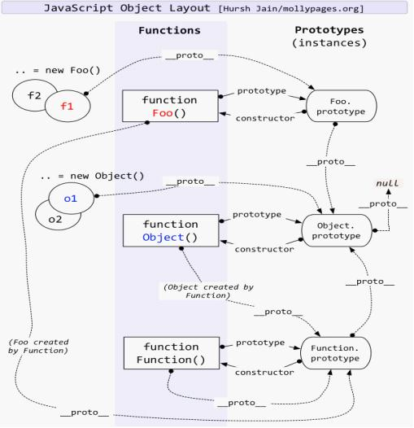

# JavaScript

> JavaScript面书 📑

## 分类

`hand-written` 手写实现类:

- [promise](./hand-written/Promise/promise.md)
- [ajax](./hand-written/ajax.md)
- [apply](./hand-written/apply.md)
- [arr-flat 数组打平](./hand-written/arrflat.md)
- [bind](./hand-written/bind.md)
- [call](./hand-written/call.md)
- [debounce](./hand-written/debounce.md)
- [indexOf](./hand-written/indexOf.md)
- [instanceof](./hand-written/instanceof.md)
- [iterator](./hand-written/iterator.md)
- [jsonp](./hand-written/jsonp.md)
- [new](./hand-written/new.md)
- [object-create](./hand-written/objectCreate.md)
- [throttle](./hand-written/throttle.md)
- [mixin](./hand-written/mixin.md)

`apply-scene` 应用场景类:

- [大小写切换](./apply-scene/Aa-convert.md)
- [数组打平去重排序](./apply-scene/array-flat-repeat-sort.md)
- [数组去重](./apply-scene/array-repeat.md)
- [复杂数组去重](./apply-scene/complex-array-repeat.md)
- [dialog 对话框](./apply-scene/dialog-class.md)
- [加解密](./apply-scene/encode-decode.md)
- [求两个日期中间的有效日期](./apply-scene/get-day-two-between.md)
- [图片的原始高度](./apply-scene/get-img-height.md)
- [身份证号验证](./apply-scene/ID-check.md)
- [数字千分符](./apply-scene/num-point.md)
- [模糊搜索关键词高亮](./apply-scene/search-key-word.md)
- [字符串去空](./apply-scene/stringToTrim.md)
- [下划线转成大驼峰](./apply-scene/undelineToCamel.md)
- [url参数解析](./apply-scene/url-parse-query-string.md)

`code-fun`代码执行实现类:

- [顺序输出0-99](./code-fun/0-99.md)
- [实现一个add函数](./code-fun/add-curry.md)
- [5.add(3).minus(2)](./code-fun/add-minus.md)
- [不用加减乘除运算符，求整数的7倍](./code-fun/bitAdd-7.md)
- [运算符优先级](./code-fun/calc-order.md)
- [链式函数, 实现lazyman](./code-fun/lazyman.md)
- [找出连续数](./code-fun/n~m.md)
- [原型链——代码题](./code-fun/prototype-run.md)
- [伪数组](./code-fun/pseudo-array.md)
- [sleep实现](./code-fun/sleep.md)
- [this输出——代码题](./code-fun/this-run.md)
- [treePath 获取](./code-fun/treePath.md)
- [create-flow 实现](./hand-written/createFlow.md)

其他：

- [传值传址的本质](./1.md)
- [判断数据类型](./2.md)
- [use strict](./3.md)
- [bind, apply, call 区别、实现](./4.md)
- [arguments 理解](./5.md)
- [eventloop 事件循环，宏、微任务执行](./6.md)
- [数据类型转换下的对象属性](./7.md)
- [偶尔的全局变量](./8.md)
- [深度，广度实现深拷贝](./9.md)
- [ES5/ES6继承](./10.md)
- [数组判断](./11.md)
- [变量声明提前](./12.md)
- [== 隐式类型转换](./13.md)
- [sort 排序](./14.md)
- [数据填充Array.from](./15.md)
- [函数形参传递](./16.md)
- [localStorage模拟兼容](./17.md)
- [用 setTimeout 实现 setInterval](./18.md)
- [特定结构normalize](./19.md)
- [异常处理](./21.md)

## 参考

- [数字正确输出 0 - 9](https://github.com/Advanced-Frontend/Daily-Interview-Question/issues/43#issuecomment-471960211)
- [深入探究 Function & Object 鸡蛋问题](https://mp.weixin.qq.com/s/4eBdJTGBIrB5JhvRrmmbaw)

- [模拟实现深拷贝](https://github.com/Advanced-Frontend/Daily-Interview-Question/issues/148)
- [input 中文输入处理](https://github.com/Advanced-Frontend/Daily-Interview-Question/issues/129#issue-446888391)
- [二进制、字符、base64](https://github.com/Advanced-Frontend/Daily-Interview-Question/issues/299#issuecomment-550113865)

## 额外阅读

那么 Babel 是如何把 ES6 转成 ES5 呢，其大致分为三步：

- 将代码字符串解析成抽象语法树，即所谓的 AST
- 对 AST 进行处理，在这个阶段可以对 ES6 代码进行相应转换，即转成 ES5 代码
- 根据处理后的 AST 再生成代码字符串
