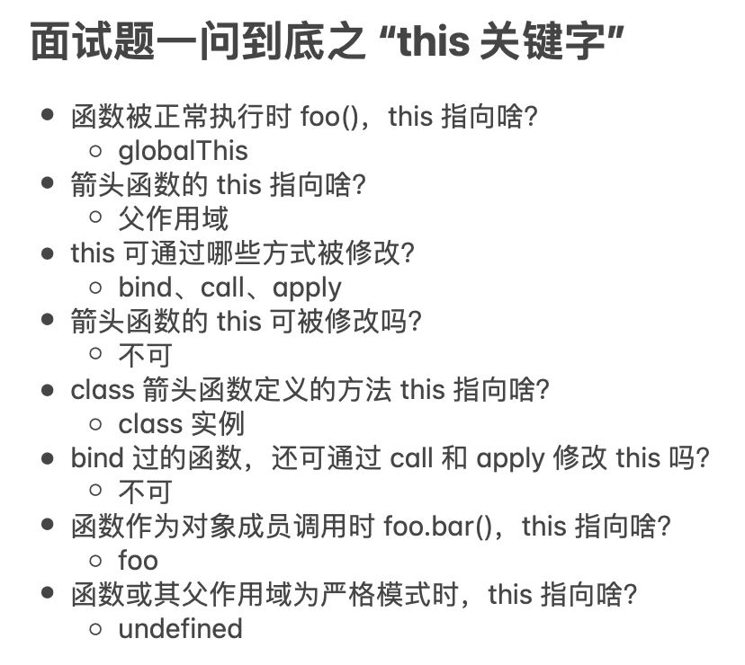

# this指向输出

> 编程题



**⚡题目**：

```js
var age = 10;
var person = {
  age: 20,
  getAge() {
    var age  =  30;
    return this.age;
  },
};
alert(age, age * 2); // 10 => alert只接受一个参数
person.getAge(); // 20
var b = person.getAge;
b(); // 10  
(person.getAge)(); // 10
(1, person.getAge)(); // 10
(1, person.getAge.bind(person))(); // 20
(person.getAge, person.getAge)(); // 10 => 只有最后一个表达式有作用
(person.getAge = person.getAge)(); // 10
person.getAge.call(); // 10
person.getAge.call(person); // 20

function getAge2()  {  
  this.age = 40;
  console.log(person.getAge());
};
getAge2(); // 20
console.log(age); // 40 => getAge2直接调用，内部的this指向window

function getAge3() {
  this.age = 50;
  this.getAge4 = () => {
    console.log(person.getAge.call(this));
  }
}
new getAge3().getAge4(); // 50
console.log(age); // 40

function getAge4() {
  this.age = 60;
  this.getAge5 = () => {  
    console.log(person.getAge.call(this));
  }
}
new getAge4().getAge5(); // 60
console.log(age); // 40

var age2 = 10;
var person2 = {
  age2: 20,
  getAge2: () => {
    var age2 = 30;
    return this.age2;
  },
};
console.log(person2.getAge2.call()); // 10
console.log(person2.getAge2.call(person2)); // 10
```
