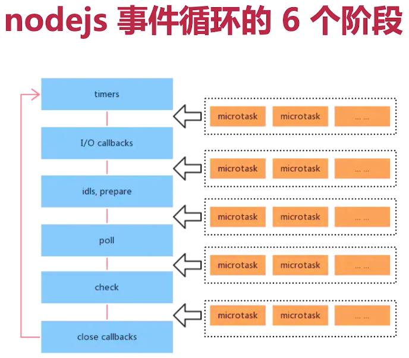

# event loop

> event loop 在 浏览器和 nodejs 执行流程

**⚡题目**:

❓ event loop 在 浏览器和 nodejs的区别

## 优解 🔥

基本执行流程是一样的



- `process.nextTick`(Node.js 环境) 微任务，优先级最高，最早被执行，但会阻塞IO
- `callback stack` 分组循环执行
- setTimeout 比 setImmediate 执行早
- setImmediate 建议用来替代 process.nextTick

6 个阶段 (宏任务类型多)

- **timers** - 执行 `setTimeout` 以及 `setInterval` 的回调
- **I/O callbacks** - 处理网络、流、TCP 的错误回调
- **idle, prepare** - 闲置阶段，node 内部使用
- **poll** - 执行 poll 中的 I/O 队列，检查定时器是否到时间
- **check** - 存放 `setImmediate` 回调
- **close callbacks** - 关闭回调，例如 `Socket.on('close')`

执行宏任务之前，都要先执行完当前的微任务

## 代码题

```js
setImmediate(() => {
    console.log('immediate') // 10
})

async function async1 () {
    console.log('async1 start') // 同步 2
    await async2() // 同步
    console.log('async1 end') // 7 await 后面的内容，异步（微任务），相当于 callback 函数里的内容
}

async function async2 () {
    console.log('async2') // 3
}

console.log('script start') // 1

setTimeout(function () {
    console.log('setTimeout') // 9
}, 0)

async1() // 同步

new Promise (function (resolve) {
    console.log('promise1') // 同步 4
    resolve()
}).then (function () {
    console.log('promise2') // 8
})

process.nextTick(() => {
    console.log('nextTick') // 6
})

console.log('script end') // 5
// 同步代码执行完成

// 同步代码执行完成之后，有哪些异步还没有被执行：
// 1. setImmediate 回调，宏任务，优先级比较低
// 2. async1 函数中，await 后面的内容，微任务
// 3. setTimeout 回调，宏任务，优先级比 setImmediate 高
// 4. promise then 回调，微任务
// 5. process.nextTick 回调，微任务，优先级在微任务中最高

```
