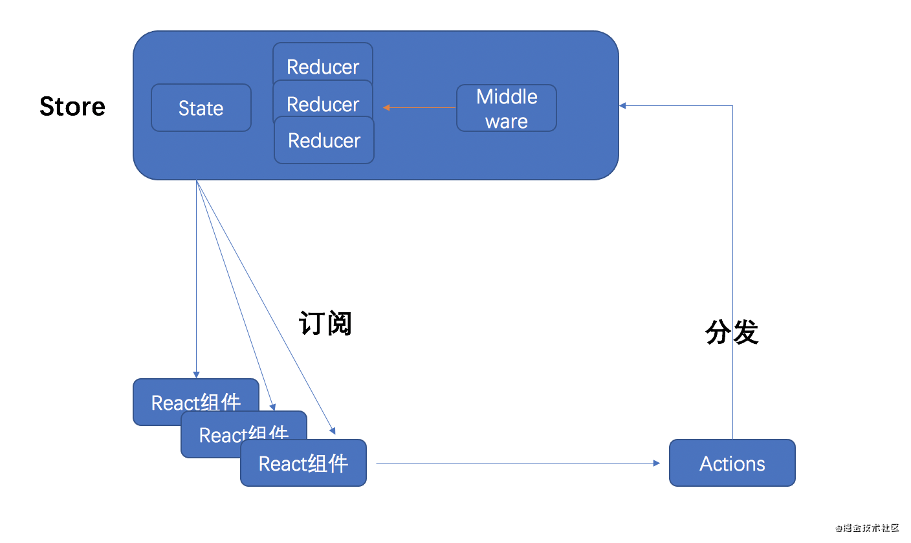
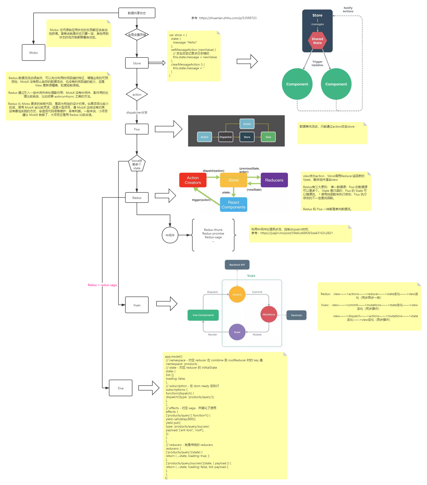

# React-Redux

> React Redux 简介

**⚡题目**:

❓ 简述React Redux

## 优解 🔥

**背景**：把组件之间需要共享的状态抽取出来，遵循特定的约定，统一来管理，让状态的变化可以预测

Redux 单一Store, 单向数据流管理

## 参考

- [Vuex、Flux、Redux、Redux-saga、Dva、MobX](https://zhuanlan.zhihu.com/p/53599723)
