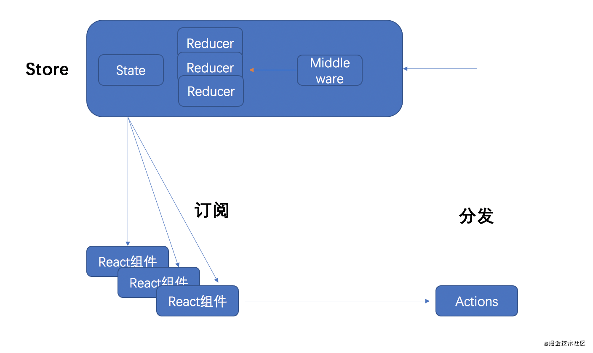
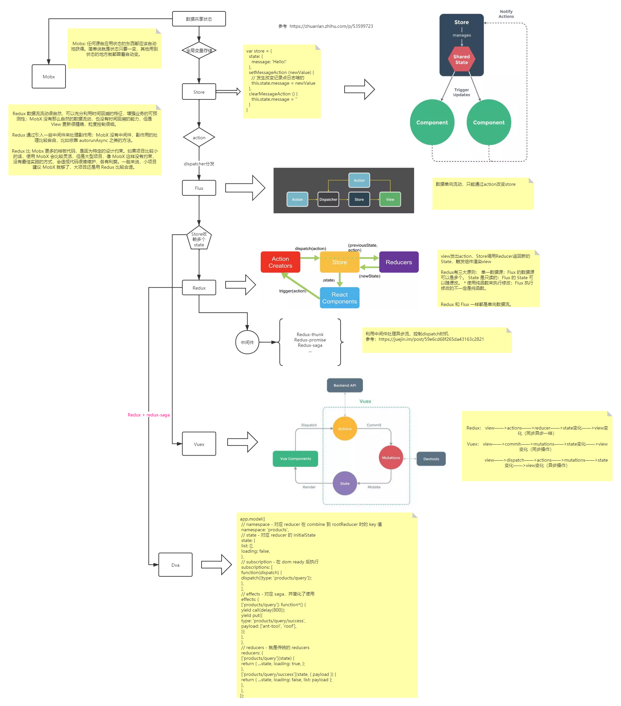

# React-Redux

> React Redux 简介

**⚡题目**:

❓ 简述React Redux

## 优解 🔥

**背景**：把组件之间需要共享的状态抽取出来，遵循特定的约定，统一来管理，让状态的变化可以预测

Redux 单一Store, 单向数据流管理
state不能直接修改，只能通过action表达修改的意图，调用dispatch()修改state
state的修改规则reducers必须是一个纯函数，不能有副作用



Redux提供的API:

1、`createStore`方法的作用就是创建一个Redux store来存放应用中所有的state

```js
createStore(reducer, [preloadState], [enhancer])
```

方法接受三个参数，后面两个是可选参数:

- `reducer`: 参数的类型必须是function
- `preloadState`: 这个参数代表初始化的state(initialState), 可以是任意类型的参数
- `enhancer`: 这个参数代表添加的各种中间件，参数的类型必须是function

createStore提供的方法：
1、`getState()`返回当前的state
2、`dispach(action)`参数action必须是一个对象，且必须含有type字段
3、`subscribe(listener)`事件监听

2、`combineReducers`主要是把多个reducer合并成一个，并且返回一个新的reducer函数，该函数接收的参数也是两个state和action

3、`compose`主要是在中间件时候使用，合成函数

```js
compose(applyMiddleware(thunk), 
  window.devToolsExtension ?
  window.devToolsExtension() : undefined
)
```

4、`applyMiddleware` 调用中间价
5、`bindActionCreator`的主要作用就是将aciton与dispatch函数绑定，生成直接可以出发action的函数


## 参考



- [Vuex、Flux、Redux、Redux-saga、Dva、MobX](https://zhuanlan.zhihu.com/p/53599723)
