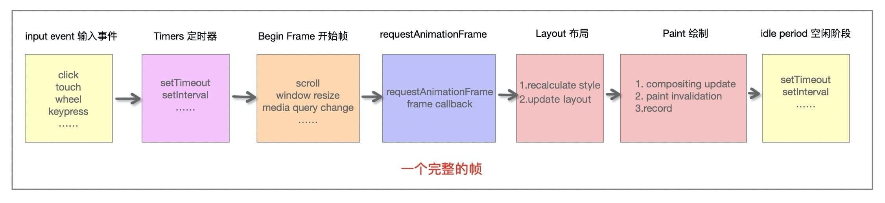
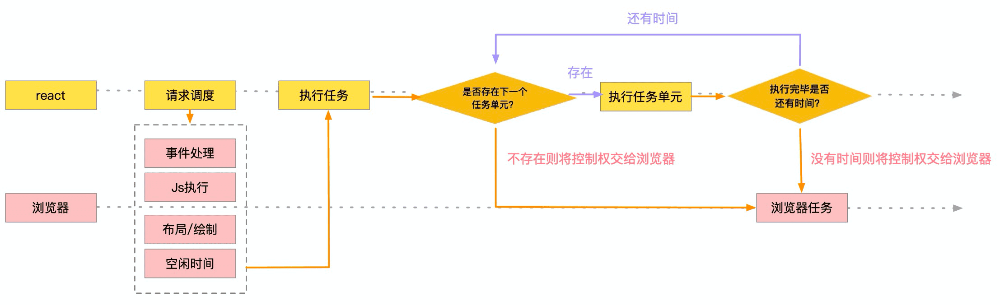
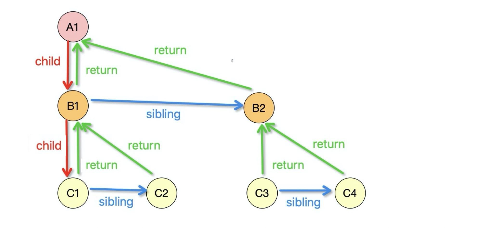

# React-Fiber

> Fiber 是对 React 核心算法的重构, 在React16 以上的版本中引入了 Fiber 架构

**⚡题目**:

❓ 简述 React Fiber 结构及设计思想

## 优解 🔥

### 背景原因

一般情况下，设备的屏幕刷新率为 1s 60次, 大于流畅，小于卡顿



js 引擎和页面渲染引擎是在同一个渲染线程之内，两者是互斥关系，如果JS执行时间过长，就会阻塞页面渲染。

**React16之前**：

react 会采用`递归对比虚拟DOM树`，找出需要变动的节点，然后同步更新它们，这个过程 react 称为`reconcilation`（协调）。在`reconcilation`期间，react 会一直占用浏览器资源，会导致用户触发的事件得不到响应
这种遍历是递归调用，执行栈会越来越深，而且不能中断，中断后就不能恢复了。

于是引入了 `Fiber` 来改变这种不可控的现状，把渲染/更新过程拆分为一个个小块的任务，通过合理的调度机制来调控时间，指定任务执行的时机，从而降低页面卡顿的概率，提升页面交互体验。通过Fiber架构，让`reconcilation`过程变得`可被中断`。适时地让出CPU执行权，可以让浏览器及时地响应用户的交互。

**React16中使用了 Fiber，但是 Vue 是没有 Fiber 的，为什么呢？原因是二者的优化思路不一样**:

- `Vue` 是基于 `template` 和 `watcher` 的组件级更新，把每个更新任务分割得足够小，不需要使用到 `Fiber` 架构，将任务进行更细粒度的拆分
- `React` 是不管在哪里调用 `setState`，都是从根节点开始更新的，更新任务还是很大，需要使用到 `Fiber` 将大任务分割为多个小任务，可以中断和恢复，不阻塞主进程执行高优先级的任务

### 什么是Fiber

Fiber 可以理解为是一个执行单元，也可以理解为是一种数据结构。

**执行单元**:



Fiber 可以被理解为划分一个个更小的执行单元，它是把一个大任务拆分为了很多个小块任务，一个小块任务的执行必须是一次完成的，不能出现暂停，但是一个小块任务执行完后可以移交控制权给浏览器去响应用户，从而不用像之前一样要等那个大任务一直执行完成再去响应用户。

**数据结构**: React Fiber 就是采用链表实现的

`Fiber` 是 React 进行重构的核心算法，`fiber` 是指数据结构中的每一个节点



```js
// fiber 节点结构
{
    
    type: any, // 对于类组件，它指向构造函数；对于DOM元素，它指定HTML tag
    key: null | string, // 唯一标识符
    stateNode: any, // 保存对组件的类实例，DOM节点或与fiber节点关联的其他React元素类型的引用
    child: Fiber | null, // 大儿子
    sibling: Fiber | null, // 下一个兄弟
    return: Fiber | null, // 父节点
    tag: WorkTag, // 定义fiber操作的类型, 详见https://github.com/facebook/react/blob/master/packages/react-reconciler/src/ReactWorkTags.js
    nextEffect: Fiber | null, // 指向下一个节点的指针
    updateQueue: mixed, // 用于状态更新，回调函数，DOM更新的队列
    memoizedState: any, // 用于创建输出的fiber状态
    pendingProps: any, // 已从React元素中的新数据更新，并且需要应用于子组件或DOM元素的props
    memoizedProps: any, // 在前一次渲染期间用于创建输出的props
    alternate: any, // 两个fiber树连接指针
    // ……     
}

```

### 实现技术

- `requestAnimationFrame`：浏览器在下次重绘之前（即下一帧）调用指定的回调函数更新动画
- `requestIdleCallback`: 能使开发者在主事件循环上执行后台和低优先级的工作，而不影响延迟关键事件，如动画和输入响应, 有多余的空闲时间，此时就会执行`requestIdleCallback`里注册的任务。
发者是可以传入`timeout`参数去定义超时时间的，如果到了超时时间了，浏览器必须立即执行，使用方法如下：`window.requestIdleCallback(callback, { timeout: 1000 })`

  - `timeRamining` 返回当前帧还剩多少时间供用户使用
  - `didTimeout` 返回 callback 任务是否超时

```js
const sleep = delay => {
  for (let start = Date.now(); Date.now() - start <= delay;) {}
}

let taskQueue = [
  () => {
    console.log('task1 start')
    sleep(20) // 已经超过一帧的时间（16.6ms），需要把控制权交给浏览器
    console.log('task1 end')
  },
  () => {
    console.log('task2 start')
    console.log('task2 end')
  },
  () => {
    console.log('task3 start')
    console.log('task3 end')
  }
]

const performUnitWork = () => {
  // 取出第一个队列中的第一个任务并执行
  taskQueue.shift()()
}

const workloop = (deadline) => {
  console.log(`此帧的剩余时间为: ${deadline.timeRemaining()}`)
  // 如果此帧剩余时间大于0或者已经到了定义的超时时间（上文定义了timeout时间为1000，到达时间时必须强制执行），且当时存在任务，则直接执行这个任务
  // 如果没有剩余时间，则应该放弃执行任务控制权，把执行权交还给浏览器
  while ((deadline.timeRemaining() > 0 || deadline.didTimeout) && taskQueue.length > 0) {
    performUnitWork()
  }

  // 如果还有未完成的任务，继续调用requestIdleCallback申请下一个时间片
  if (taskQueue.length > 0) {
    window.requestIdleCallback(workloop, { timeout: 1000 })
  }
}

requestIdleCallback(workloop, { timeout: 1000 })
```

### 执行原理

从根节点开始渲染和调度的过程可以分为两个阶段：`render` 阶段、`commit` 阶段。

- `render` 阶段：这个阶段是可中断的，会找出所有节点的变更
- `commit` 阶段：这个阶段是不可中断的，会执行所有的变更

**render阶段**: 找出所有节点的变更，如节点新增、删除、属性变更等，这些变更 react 统称为副作用`effect`

此阶段会构建一棵`Fiber tree`，以虚拟dom节点为维度对任务进行拆分，即`一个虚拟dom节点对应一个任务`，最后产出的结果是`effect list`，从中可以知道哪些节点更新、哪些节点增加、哪些节点删除了

- [遍历Fiber tree](./fiber-traverse.jpg)
- [收集effect list的遍历顺序](./effect-list.png)

- `firstEffect`：指向第一个有副作用的子fiber
- `lastEffect`：指向最后一个有副作用的子fiber

**commit阶段**: 需要将上阶段计算出来的需要处理的副作用一次性执行，此阶段不能暂停，否则会出现UI更新不连续的现象。此阶段需要根据effect list，将所有更新都 commit 到DOM树上

**双缓冲**： 每个React元素节点，用两颗fiber树保存状态，一颗树保存当前状态，一个树保存上一次的状态，两棵 fiber 树用 `alternate` 相互指向。就是我们耳熟能详的双缓冲。

**双缓冲树**：React 用 workInProgress树(内存中构建的树) 和 current(渲染树) 来实现更新逻辑。我们console.log打印的fiber都是在内存中即将 workInProgress的fiber树。双缓存一个在内存中构建，在下一次渲染的时候，直接用缓存树做为下一次渲染树，上一次的渲染树又作为缓存树，这样可以防止只用一颗树更新状态的丢失的情况，又加快了dom节点的替换与更新。

**更新机制**：在一次更新中，首先会获取current树的 alternate作为当前的 workInProgress，渲染完毕后，workInProgress 树变为 current 树。我们用如上的树A和树B和已经保存的baseState模型，来更形象的解释了更新机制 。 hooks中的useState进行state对比，用的是缓存树上的state和当前最新的state。所有就解释了为什么更新相同的state，函数组件执行2次了。


