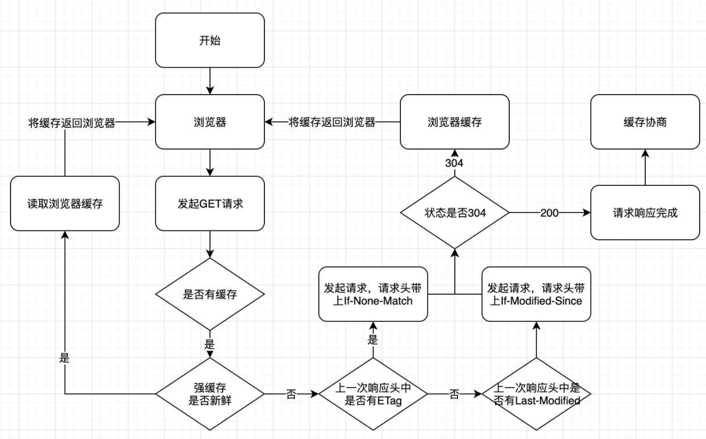

# http缓存

> http 的整体缓存流程

❓ 简单讲解一下 HTTP 的缓存机制

## 优解 🚀

HTTP 缓存分为 2 种，一种是强缓存，另一种是协商缓存。主要作用是可以加快资源获取速度，提升用户体验，减少网络传输，缓解服务端的压力。



### 强缓存

不需要发送请求到服务端，直接读取浏览器本地缓存，在 Chrome 的 Network 中显示的 HTTP 状态码是 200 ，在 Chrome 中，强缓存又分为 `Disk Cache` (存放在硬盘中)和 `Memory Cache` (存放在内存中)，存放的位置是由浏览器控制的。是否强缓存由 `Expires`、`Cache-Control` 和 `Pragma` 3 个 Header 属性共同来控制。

**Expires**: HTTP缓存日期控制，根据系统时间和 Expires 的值进行比较

当系统时间和服务器时间不一致的时候，会有缓存有效期不准的问题。Expires 的优先级在三个 Header 属性中是最低的。

**Cache-Control**：HTTP/1.1 中新增的属性，在请求头和响应头中都可以使用

- `max-age`：单位是秒，缓存时间计算的方式是距离发起的时间的秒数，超过间隔的秒数缓存失效
- `no-cache`：不使用强缓存，需要与服务器验证缓存是否新鲜
- `no-store`：禁止使用缓存（包括协商缓存），每次都向服务器请求最新的资源
- `private`：专用于个人的缓存，中间代理、CDN 等不能缓存此响应
- `public`：响应可以被中间代理、CDN 等缓存
- `must-revalidate`：在缓存过期前可以使用，过期后必须向服务器验证

**Pragma**: Pragma 只有一个属性值，就是 no-cache ，效果和 Cache-Control 中的 no-cache 一致，

不使用强缓存，需要与服务器验证缓存是否新鲜，在 3 个头部属性中的优先级最高
当 Pragma 和 Cache-Control 同时存在的时候，Pragma 的优先级高于 Cache-Control。

```js
const express = require('express');
const app = express();
var options = { 
  etag: false, // 禁用协商缓存
  lastModified: false, // 禁用协商缓存
  setHeaders: (res, path, stat) => {
    res.set('Cache-Control', 'max-age=10'); // 强缓存超时时间为10秒
  },
};
app.use(express.static((__dirname + '/public'), options));
app.listen(3000);

```

### 协商缓存

当浏览器的强缓存失效的时候或者请求头中设置了不走强缓存，并且在请求头中设置了`If-Modified-Since` 或者 `If-None-Match` 的时候，会将这两个属性值到服务端去验证是否命中协商缓存，如果命中了协商缓存，会返回 304 状态，加载浏览器缓存，并且响应头会设置 `Last-Modified` 或者 `ETag` 属性。

**ETag/If-None-Match**: 是一串 hash 码，代表的是一个资源的标识符，当服务端的文件变化的时候，它的 hash码会随之改变.

通过请求头中的 If-None-Match 和当前文件的 hash 值进行比较，如果相等则表示命中协商缓存。ETag 又有强弱校验之分，如果 hash 码是以 "W/" 开头的一串字符串，说明此时协商缓存的校验是弱校验的，只有服务器上的文件差异（根据 ETag 计算方式来决定）达到能够触发 hash 值后缀变化的时候，才会真正地请求资源，否则返回 304 并加载浏览器缓存。

**Last-Modified/If-Modified-Since**: 代表的是文件的最后修改时间

第一次请求服务端会把资源的最后修改时间放到 Last-Modified 响应头中，第二次发起请求的时候，请求头会带上上一次响应头中的 Last-Modified 的时间，并放到 If-Modified-Since 请求头属性中，服务端根据文件最后一次修改时间和 If-Modified-Since 的值进行比较，如果相等，返回 304 ，并加载浏览器缓存。

```js
const express = require('express');
const app = express();
var options = { 
  etag: true, // 开启协商缓存
  lastModified: true, // 开启协商缓存
  setHeaders: (res, path, stat) => {
    res.set({
      'Cache-Control': 'max-age=00', // 浏览器不走强缓存
      'Pragma': 'no-cache', // 浏览器不走强缓存
    });
  },
};
app.use(express.static((__dirname + '/public'), options));
app.listen(3001);

```

为了保证 lastModified 不影响缓存，通过 Last-Modified/If-Modified-Since 请求头删除了

```js
const express = require('express');
const CryptoJS = require('crypto-js/crypto-js');
const fs = require('fs');
const app = express();
var options = { 
  etag: true, // 只通过Etag来判断
  lastModified: false, // 关闭另一种协商缓存
  setHeaders: (res, path, stat) => {
    const data = fs.readFileSync(path, 'utf-8'); // 读取文件
    const hash = CryptoJS.MD5((JSON.stringify(data))); // MD5加密
    res.set({
      'Cache-Control': 'max-age=00', // 浏览器不走强缓存
      'Pragma': 'no-cache', // 浏览器不走强缓存
      'ETag': hash, // 手动设置Etag值为MD5加密后的hash值
    });
  },
};
app.use(express.static((__dirname + '/public'), options));
app.listen(4000); // 使用新端口号，否则上面验证的协商缓存会一直存在

```
