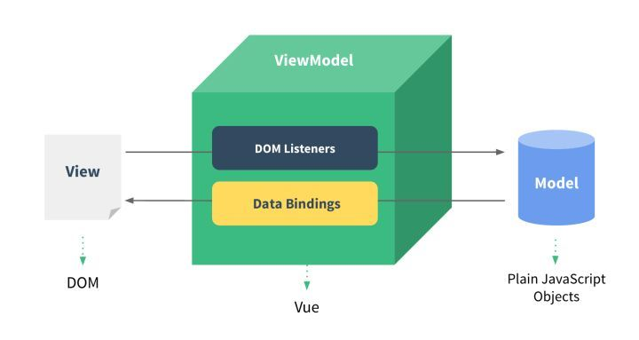

# P1

> Vue 中的 双向数据绑定

**⚡题目**:

❓ 聊聊 Vue 的双向数据绑定，Model 如何改变 View，View 又是如何改变 Model 的？

## 优解 🔥



- 从 M 到 V 的映射（Data Binding），这样可以大量节省你人肉来 update View 的代码
- 从 V 到 M 的事件监听（DOM Listeners），这样你的 Model 会随着 View 触发事件而改变

[v-model 自定义组件结合](https://juejin.im/post/5c77c53051882523f0267e18)

```html
<currency-input v-model="price"></currentcy-input>
<!--上行代码是下行的语法糖
  <currency-input :value="price" @input="price = arguments[0]"></currency-input>
-->
```

给组件添加 v-model 属性时，默认会把 value 作为组件的属性，然后把 'input' 值作为给组件绑定事件时的事件名

**Vue2.x**时代

`Object.definedProperty`

```html
<input type="text" id='inp'>
<div id='view'></div>
<script>
    const input = document.getElementById('inp');
    const view = document.getElementById('view');

    let data = {
        // name: 'view'
        valueObj:{
            name:'view'
        }
    }

    function update() { //更新视图
        view.innerText = data.valueObj.name;
    }

    input.oninput = function () { //更新数据
        data.valueObj.name = this.value
    }

    function observerData(obj) {
        if (!obj || typeof obj != 'object') return obj; //容错 + 递归出口

        Object.keys(obj).forEach(key => {
            definedRective(obj, key, obj[key]);
        })
    }

    observerData(data);

    function definedRective(obj, key, val) {

        observerData(val); //深层数据递归处理

        Object.defineProperty(obj, key, {
            get() {
                return val;
            },
            set(newVal) {
                if (val === newVal) return; //优化性能
                val = newVal;
                update();
            }
        })
    }
</script>
```

- 不能直接监控数组，而是间接重写Array.prototype上的数组方法(就是vue中常常听见的数组变异方法)比如push、unshfit...属性,监听数组原型上的这些方法,进而实现更新
- 如果被监听对象在执行监听之后又重新添加了属性,这些属性值则无法监听到

**Vue3.x**展望

`Proxy&Reflect`

```js
let oProxy = new Proxy(data, {
    get(target, key, receiver) {
        console.log(1)
        return Reflect.get(target, key);
    },
    set(target, key, newValue, receiver) {
        console.log(1)
        return Reflect.set(target, key, newValue)
    }
});
```

## 观察者模式

- `observer（监听器）`：注意，此 observer 非彼 observer。在我们上节的解析中，observer 作为设计模式中的一个角色，代表“订阅者”。但在Vue数据双向绑定的角色结构里，所谓的 observer 不仅是一个数据监听器，它还需要对监听到的数据进行转发——也就是说它同时还是一个发布者。
- `watcher（订阅者）`：observer 把数据转发给了真正的订阅者——watcher对象。watcher 接收到新的数据后，会去更新视图。
- `compile（编译器）`：MVVM 框架特有的角色，负责对每个节点元素指令进行扫描和解析，指令的数据初始化、订阅者的创建这些“杂活”也归它管~

```js
// observe方法遍历并包装对象属性
function observe(target) {
    // 若target是一个对象，则遍历它
    if(target && typeof target === 'object') {
        Object.keys(target).forEach((key)=> {
            // defineReactive方法会给目标属性装上“监听器”
            defineReactive(target, key, target[key])
        })
    }
}

// 定义defineReactive方法
function defineReactive(target, key, val) {
    const dep = new Dep()
    // 属性值也可能是object类型，这种情况下需要调用observe进行递归遍历
    observe(val)
    // 为当前属性安装监听器
    Object.defineProperty(target, key, {
         // 可枚举
        enumerable: true,
        // 不可配置
        configurable: false,
        get: function () {
            return val;
        },
        // 监听器函数
        set: function (value) {
            console.log(`${target}属性的${key}属性从${val}值变成了了${value}`)
            val = value
            // 通知所有订阅者
            dep.notify()
        }
    });
}

// 定义订阅者类Dep
class Dep {
    constructor() {
        // 初始化订阅队列
        this.subs = []
    }

    // 增加订阅者
    addSub(sub) {
        this.subs.push(sub)
    }

    // 通知订阅者（是不是所有的代码都似曾相识？）
    notify() {
        this.subs.forEach((sub)=>{
            sub.update()
        })
    }
}
```
